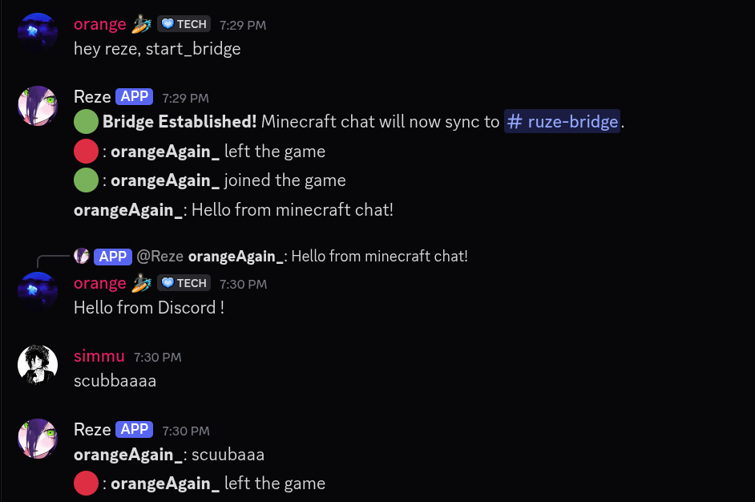
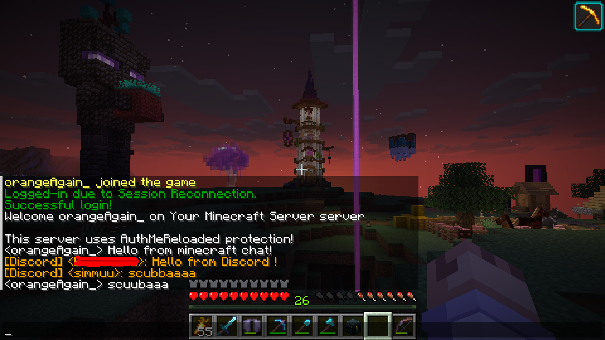

# 💥 RUZE

RUZE is a lightweight, high-performance Discord–Minecraft bridge bot themed after Reze from *Chainsaw Man*. Built in Rust using `poise` and `serenity`, RUZE establishes a seamless, two-way communication channel between your Discord server and a Minecraft server.

Unlike traditional bridges, RUZE uses direct log-tailing to read Minecraft server events **without requiring any mods or plugins** installed on the server itself.

---

## Features

- **Zero-Client Bridge** — Tails Minecraft server logs natively via `linemux`. No client mods, Forge, Fabric, or Paper plugins required.
- **Live Chat Sync** — Forwards Minecraft in-game chat to Discord and vice versa.
- **Server Events** — Death messages, advancements, and player join/leave formatted and beamed into Discord.
- **Player List** — `/info` command queries the server and displays online players with latency.
- **Structured Logging** — Full `tracing`-based observability with configurable verbosity (`RUST_LOG`).
- **Secure Access** — Critical bridge commands restricted to the Bot Owner and Server Administrators.




---

## Minecraft Server Configuration

Enable **RCON** (for sending Discord → Minecraft messages and querying player lists) in your Minecraft server's `server.properties`. Server List Ping (used by `/info` for MOTD and latency) works out-of-the-box on vanilla servers:

```properties
enable-rcon=true
rcon.port=25575
rcon.password=your_secure_rcon_password_here
```

Restart your Minecraft server after saving these changes.

---

## Configuration

RUZE uses a layered configuration system. Values are resolved from **lowest to highest priority**:

| Priority | Source | Purpose |
|----------|--------|---------|
| 1 (lowest) | `/etc/ruze.toml` | System-wide defaults (all users) |
| 2 | `$XDG_CONFIG_HOME/ruze.toml` | Per-user config (falls back to `~/.config/ruze.toml`) |
| 3 | `$HOME/.ruze.toml` | Per-user home-directory override |
| 4 (highest) | Environment variables | `RUZE_*` prefix |

Each layer merges on top of the previous one — later sources override earlier ones. Environment variables always take precedence.

### TOML configuration file

Create a `ruze.toml` in any of the supported paths above. All sections are required unless a default is noted.

```toml
[discord]
# Your Discord Bot Application token
token = "your_discord_bot_token_here"

[rcon]
# RCON server address and port (default: "localhost:25575")
address = "localhost:25575"
# RCON password set in server.properties
password = "your_secure_rcon_password_here"

[minecraft]
# Minecraft server address and port for status pings (default: "localhost:25565")
server_address = "localhost:25565"

[bot]
# Discord user ID of the bot owner
owner_id = 1314616785156444175
# Optional: Discord guild (server) ID for instant slash command registration.
# When set, commands appear immediately in this guild instead of waiting
# for Discord's global sync (which can take up to an hour).
# guild_id = 1234567890123456789

[log]
# Absolute path to the Minecraft server's latest.log file
path = "/var/minecraft/logs/latest.log"
```

### Environment variables (highest priority)

Each TOML field has a corresponding `RUZE_*` environment variable. Use these for Docker, systemd, or CI deployments.

| Variable | TOML field | Required | Default |
|----------|-----------|----------|---------|
| `RUZE_DISCORD_TOKEN` | `discord.token` | Yes | — |
| `RUZE_LOG_PATH` | `log.path` | Yes | — |
| `RUZE_RCON_PASSWORD` | `rcon.password` | Yes | — |
| `RUZE_RCON_ADDRESS` | `rcon.address` | No | `localhost:25575` |
| `RUZE_MC_SERVER_ADDRESS` | `minecraft.server_address` | No | `localhost:25565` |
| `RUZE_OWNER_ID` | `bot.owner_id` | Yes | — |
| `RUZE_GUILD_ID` | `bot.guild_id` | No | — (instant slash cmd sync) |

<details>
<summary>Deprecated environment variable names</summary>

The old variable names are still detected for backward compatibility but log a deprecation warning:

| Deprecated | Replacement |
|-----------|-------------|
| `DISCORD_TOKEN` | `RUZE_DISCORD_TOKEN` |
| `LOG_PATH` | `RUZE_LOG_PATH` |
| `RCON_PASSWORD` | `RUZE_RCON_PASSWORD` |
| `RCON_SERVER_ADDRESS` | `RUZE_RCON_ADDRESS` |
| `MC_SERVER_QUERY_ADDRESS` | `RUZE_MC_SERVER_ADDRESS` |
</details>

### Quick-start: local config file

The fastest way to get started is a single local config file:

```bash
mkdir -p ~/.config
cat > ~/.config/ruze.toml << 'EOF'
[discord]
token = "your_discord_bot_token_here"

[rcon]
password = "your_secure_rcon_password_here"

[bot]
owner_id = 1314616785156444175

[log]
path = "/var/minecraft/logs/latest.log"
EOF
```

---

## Discord Setup

Enable **Privileged Gateway Intents** in the [Discord Developer Portal](https://discord.com/developers/applications):

1. Select your Application → **Bot** tab.
2. Under **Privileged Gateway Intents**, enable **Server Members Intent** and **Message Content Intent**.

---

## Build & Run

```bash
# Debug build
cargo run

# Release build (recommended for production)
cargo run --release
```

### Logging

RUZE outputs structured logs to stderr. Control verbosity via the `RUST_LOG` environment variable:

```bash
# Default — info and above only
cargo run --release

# Verbose — debug messages included
RUST_LOG=debug cargo run --release

# Everything — trace-level detail
RUST_LOG=trace cargo run --release

# Silence noisy crates, show only RUZE logs
RUST_LOG=info,serenity=warn,tracing=warn cargo run --release
```

Log format includes RFC 3339 timestamps, file location, and structured fields:

```
2026-06-17T10:30:00.123Z  INFO main.rs:18 starting Ruze bridge...
2026-06-17T10:30:00.125Z  INFO consts.rs:88 loading configuration...
2026-06-17T10:30:00.127Z DEBUG consts.rs:97 merged /home/user/.config/ruze.toml
2026-06-17T10:30:00.128Z  INFO consts.rs:106 configuration validated
2026-06-17T10:30:00.130Z  INFO main.rs:32 log watcher started | path=/var/mc/logs/latest.log
2026-06-17T10:30:00.131Z  INFO rcon.rs:16 RCON connected to localhost:25575
2026-06-17T10:30:00.132Z  INFO main.rs:62 Discord → Minecraft relay started
2026-06-17T10:30:00.133Z  INFO main.rs:73 bridge is now running
2026-06-17T10:30:03.456Z  INFO handler.rs:123 bot logged in | name=Reze#1234
2026-06-17T10:30:04.789Z DEBUG log_parser.rs:91 chat event parsed | username=Herobrine
2026-06-17T10:30:04.790Z  INFO main.rs:46 mc→dc | username=Herobrine
2026-06-17T10:30:10.001Z  INFO commands.rs:24 command /ping executed | user=Admin
```

---

## Bot Commands

All commands support both `~` prefix (`~ping`) and Slash Commands (`/ping`).

| Command | Access | Description |
|---------|--------|-------------|
| `~help` | Everyone | List all commands or get detailed help for a specific one |
| `~ping` | Everyone | Check if the bot is alive |
| `~info` | Everyone | Query the Minecraft server for online players, MOTD, and latency |
| `~start_bridge` | Owner/Admin | Bind the log stream to the current channel — live chat forwarding begins |
| `~stop_bridge` | Owner/Admin | Unbind the log stream and halt chat forwarding to the current channel |

The bot also responds to `hey reze` and `hey reze,` as alternative prefixes.

---

## Architecture

```
src/
  main.rs          — Entry point: channel setup, task spawning, glue
  consts.rs        — Configuration loading (TOML + env vars, XDG paths)
  log_parser.rs    — Minecraft log line → structured event parsing
  rcon.rs          — RCON client connection & authentication
  bot/
    mod.rs         — BotError enum, module docs
    types.rs       — Data, FromDiscordEvent, FromMinecraftEvent
    handler.rs     — Framework setup, event_handler, mc→dc forwarding
    commands.rs    — All poise slash/prefix commands
```
